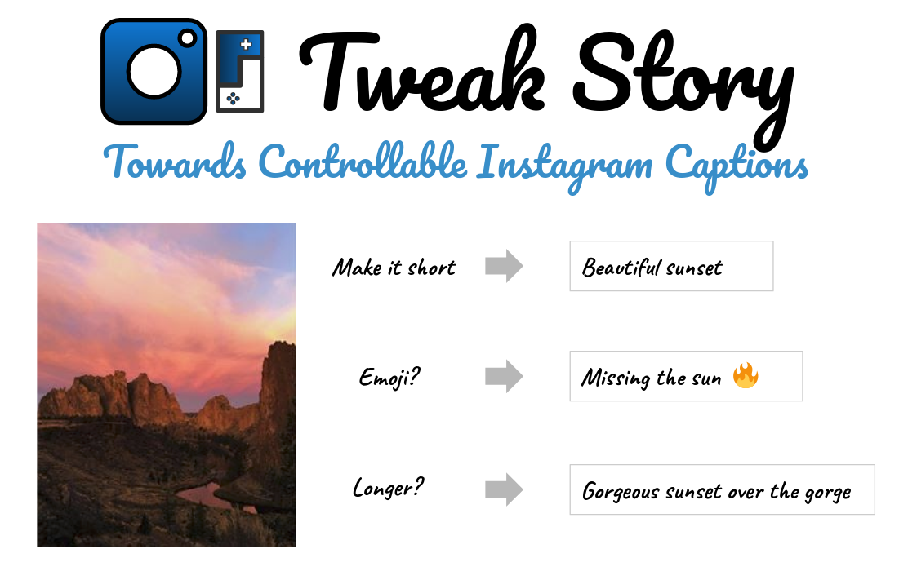
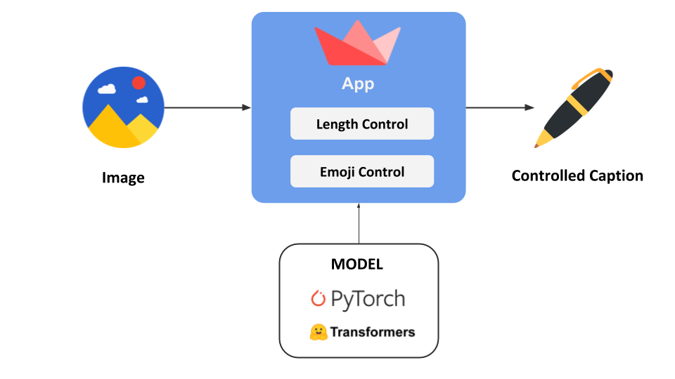

<div align="center">
  
</div>

<br>
<p align="center">
    <a href="https://img.shields.io/badge/current%20release-v0.1-blue">
        
    </a>
    <a href="https://img.shields.io/badge/license-MIT-green">
        
    </a>
    <a href="https://www.python.org/">
        
    </a>
</p>

Tweak Story is an open-source project towards generating controllable Instagram captions, powered by PyTorch, Transformers and Streamlit. We apply attention-based condition LSTM network to generate engaging captions that can be tweaked by our users. With different attributes we offer, user can easily mix and match different combination of attributes for their own flavor. In current stage, we offer sentence length and emoji flag as available attributes. 

## Demo
<div align="center">
  
</div>


## Project Structure
This project has 4 major parts :
1. `app.py` - Main script for launching our Streamlit app
2. `src` - This folder contains all utility scripts for powering the app
3. `ckpts` - This folder contains model checkpoint, word map and configuration file for our model
4. `demo` - This folder contains example images you can try out in our app

<div align="center">
  
</div>


## Prerequisites
Download the following files and place them into `ckpts` folder
- [model checkpoint](https://drive.google.com/file/d/1EwzENhOilz9bKLIVcz22qn0Ip8wIwwFr/view?usp=sharing)
- [word map file](https://drive.google.com/file/d/1FW4J2ZB3BQd_7zdxxgjZ63WMbFYm2crn/view?usp=sharing)
- [configuration file](https://drive.google.com/file/d/1yTtOwbFVDPUE7Jpnlq9aG5y0_jEgd9rS/view?usp=sharing)

## Install and Run in Docker
Clone the repo and navigate to the repo:
```
git clone https://github.com/namanphy/Controllable-Image-Captioning-App.git
cd stylised-controllable-image-captioning-StreamlitApp
```

Build the image and run the docker container locally:
```
docker build -t ctrl-img-cap-streamlit:latest .
docker run -d -p 8501:8501 ctrl-img-cap-streamlit:latest
```
Navigate to http://localhost:8501 for the app. (Streamlit runs on port 8501 by default)

*Note : When you'll run the container for the first time it will download a resnet101 model. The Streamlit app is run in CPU.*

To stop the container :
```
docker ps
docker stop <containerId>
```

## Install and Run in Conda (Alternative)
Clone the repo and navigate to the repo directory:
```
git clone https://github.com/namanphy/Controllable-Image-Captioning-App.git
cd stylised-controllable-image-captioning-StreamlitApp
```

Make a python3.6 conda environment and install requirements:
```
conda create -n app-env python=3.6
conda activate app-env
pip install -r requirements.txt
```

Run below command to launch the Streamlit app:
```
streamlit run app.py
```

Navigate to http://localhost:8501 for the app.

## Run Unit Test
```
pytest -s tests
```

## About This Project
This project is a part of [Data Science Incubator (Summer 2020)](https://madewithml.com/incubator/) organized by Made With ML, jointly developed by [Alex Lau](https://madewithml.com/@riven314/) and [Naman Bhardwaj](https://madewithml.com/@namanphy/). We constantly look for better generation quality and deployment strategy. We welcome your contributions and please contact us if you do!

## Acknowledgement
Our work is mainly based upon the following published research:
```
@article{Xu2015show,
    title={Show, Attend and Tell: Neural Image Caption Generation with Visual Attention},
    author={Xu, Kelvin and Ba, Jimmy and Kiros, Ryan and Cho, Kyunghyun and Courville, Aaron and Salakhutdinov, Ruslan and Zemel, Richard and Bengio, Yoshua},
    journal={arXiv preprint arXiv:1502.03044},
    year={2015}
} 
```

```
@article{Ficler2017show,
    title={Controlling Linguistic Style Aspects in Neural Language Generation},
    author={Jessica Ficler and Yoav Goldberg},
    journal={arXiv preprint arXiv:1707.02633},
    year={2017}
} 
```
