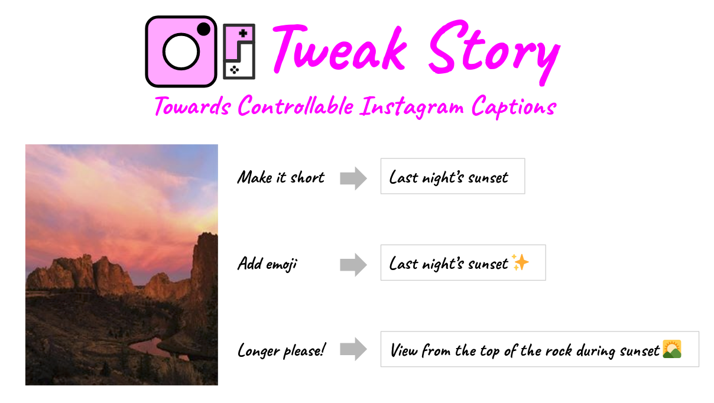

<div align="center">
  
</div>

<br>
<p align="center">
    <a href="https://img.shields.io/badge/current%20release-v0.1-blue">
        
    </a>
    <a href="https://img.shields.io/badge/license-MIT-green">
        
    </a>
    <a href="https://www.python.org/">
        
    </a>
</p>

Vanilla Image captioning model usually aims for factual precision but lack of engagement. Such goal limits the application 
of image captioning. We tried to build an image captioning model that sounds like human and relevant to the image. Such 
features are valuable in many applications such as social media and advertisement. 
To increase the usability of the model, a control is added on different attributes, such as **length of sentence** and 
**control of emojis**.

## Demo
<div align="center">
  
</div>


## Project Structure
This project has four major parts :
1. `app.py` - This contains Streamlit app that receives an image through GUI and computes the required captions.
2. `src` - This folder contains the model and other utilities required to generate captions.
3. `ckpts` - This folder will contain the required model and `config.json` file.


## Prerequisites
The model is based on Pytorch and Transformers. For this app you need 
Streamlit.
Download the following files and put them into `ckpts` folder:  
- [model checkpoint](https://drive.google.com/file/d/1ciN8Iz1qE1JTmo8TEMMUxBN-LvUovd6B/view?usp=sharing)
- [word map file](https://drive.google.com/file/d/1MLRazOJwn52dfYnPP83u0qsKj3uf6Jn6/view?usp=sharing)
  

## Get it run quickly
Clone the repo and navigate to the repo directory.
```
git clone https://github.com/namanphy/stylised-controllable-image-captioning-StreamlitApp.git
cd stylised-controllable-image-captioning-StreamlitApp
```

You can quickly build and run the docker image locally with:
```
docker build -t ctrl-img-cap-streamlit:latest .
docker run -d -p 8501:8501 ctrl-img-cap-streamlit:latest
```
And navigate to URL **http://localhost:8501** for the app. *(Streamlit runs on port 8501 by default)*

*Note : When you'll run the container for the first time it will download a resnet101 model.*

## Installation
**Alternatively for development you can create and manage a python environment** : 

Make a python3.6 environment *(either pipenv or conda env)*, install requirements.
```
conda create -n 'app-env' python=3.6
pip install -r requirements.txt
```

And, run `app.py` using below command to start the Streamlit app.
```
streamlit run app.py
```

## Running Unit Test
```
pytest -s tests
```

## About This Project
This project is a part of [Data Science Incubator (Summer 2020)](https://madewithml.com/incubator/) organized by Made With ML, jointly developed by [Alex Lau](https://madewithml.com/@riven314/) and [Naman Bhardwaj](https://madewithml.com/@namanphy/). We constantly look for better generation quality and deployment strategy. We welcome your contributions and please contact us if you do!

## Acknowledgement
Our work is mainly based upon the following published research:
```
@article{Xu2015show,
    title={Show, Attend and Tell: Neural Image Caption Generation with Visual Attention},
    author={Xu, Kelvin and Ba, Jimmy and Kiros, Ryan and Cho, Kyunghyun and Courville, Aaron and Salakhutdinov, Ruslan and Zemel, Richard and Bengio, Yoshua},
    journal={arXiv preprint arXiv:1502.03044},
    year={2015}
} 
```

```
@article{Ficler2017show,
    title={Controlling Linguistic Style Aspects in Neural Language Generation},
    author={Jessica Ficler and Yoav Goldberg},
    journal={arXiv preprint arXiv:1707.02633},
    year={2017}
} 
```